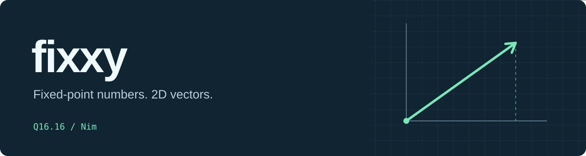

# Fixxy - Deterministic fixed-point numbers and 2D vectors.

`nimby install https://github.com/treeform/fixxy`


Only depends on the Nim standard library.

## Introduction

Fixxy provides fixed-point math utilities for you. Is it faster than float? No, it is not faster than float, but it is deterministic. This is the biggest reason why you want to use fixed point. The idea is that you can run the same fixed-point math with different compilers and architectures, and it will produce the exact same results. This is hard to achieve if you use floating point. Yes, you can work hard to make floating point deterministic, but it's just too annoying. With fixed point, you pay a price for that determinism. It is slower and more awkward to use, but you get the same results on Mac, Windows, or Linux, on ARM or x86.

This is the main reason why you want to use fixed point: to make your simulation behave the same across platforms. Games are a great example, especially strategy games where you want to run a lockstep simulation. When you run it on Mac, Windows, or Linux, the same starting state, inputs, and random seeds should produce the exact same results. This means you do not have to send the state of every object. All you have to do is send the inputs and seeds and compare hashes to check that everything still matches. That's why you want to use fixed point. That's why you want to use this library, and that's why it exists.

There are many different kinds of fixed-point formats, with different numbers of bits for the whole and fractional parts. Here I chose 16 bits for the whole part, including the sign, and 16 bits for the fractional part, mainly for convenience. You can do a lot of stuff with that, and the whole thing fits inside one 32-bit word, which is nice. I think it's a good compromise. Multiplication and division use integer arithmetic with shifts to account for the fractional bits. The split is easy to understand, so it remains conceptually simple.

Yes, you could have many different fixed-point formats where you use different numbers of bits for different parts, but here I just tried to do a very simple one. Hopefully it will work for you and your simulation. You can scale your simulation to fit this fixed-point format. The sizes were chosen to be all-around good numbers.

## Example

```nim
import fixxy

let
  position = fixedVec2(1, 2)
  target = fixedVec2(4, 6)
  velocity = normalize(target - position) * 0.25'fx
  next = position + velocity

echo next # fixedVec2(1.15001, 2.20000)
```

Use it as a dependency in another package:

```nim
requires "https://github.com/treeform/fixxy"
```

## Numbers

`Fixed` stores a signed Q16.16 value in one `int32`. Its range is -32768 to just under 32768, with a step size of about 0.00001526 (exactly 1/65536). Text output rounds values to five decimal places.

- Construct whole numbers with `fixed(3)` and decimals with `1.5'fx`.
- Parse decimal strings with `parseFixed`. Invalid input raises `FixxyError`, which inherits from `ValueError`.
- Convert at input and output boundaries with `toFixed`, `toFloat32`, `toFloat64`, and `toInt`.
- Arithmetic includes rounding, comparisons, clamping, interpolation, `multiplyDivide`, square roots, and trigonometry in radians.
- Multiplication and division round to nearest with ties toward positive infinity. Decimal parsing and float conversion round ties away from zero.
- Overflow wraps. Use `-d:fixedChecks` to assert checked intermediate ranges. Negation and `abs` of `FixedMinimum` still wrap to `FixedMinimum`.
- Division and modulo by zero raise `AssertionDefect`.

The trigonometry tables are generated at compile time. Tests pin table entries and the original simulation arithmetic hash to detect changes between builds. The package targets Nim's native C and C++ backends.

## Vectors

`FixedVec2` contains two `Fixed` coordinates, `x` and `y`, in eight bytes. It supports component arithmetic, scalar multiplication and division, indexing, dot and cross products, lengths, distances, normalization, rotation, angles, and interpolation. Normalizing zero returns zero.

`lengthSquared` and `distanceSquared` return raw Q32.32 values in an `int64`. Lengths must fit in `Fixed`, and coordinate differences use wrapping fixed arithmetic. Keep vectors and intermediate results within the numeric range.

## Development

```sh
nim r tests/tests.nim
nim r -d:release tests/tests.nim
nim r -d:fixedChecks tests/tests.nim
nim r examples/movement.nim
```

The optional benchmark uses Benchy:

```sh
nimby install -g benchy
nim r -d:release tests/bench_fixed.nim
```

## Origin

Extracted from [Metta-AI/polyworld](https://github.com/Metta-AI/polyworld), commit `617cb962ee8e88a256ec2728f9ef82d0b2cb3930`:

- `src/polyworld/fixed.nim`
- `tests/test_fixed.nim`
- `tests/bench_fixed.nim`

The original `Fixed`, `FixedVec2`, constants, and arithmetic are preserved. Extraction, packaging, documentation, and additional tests were prepared with AI assistance.
